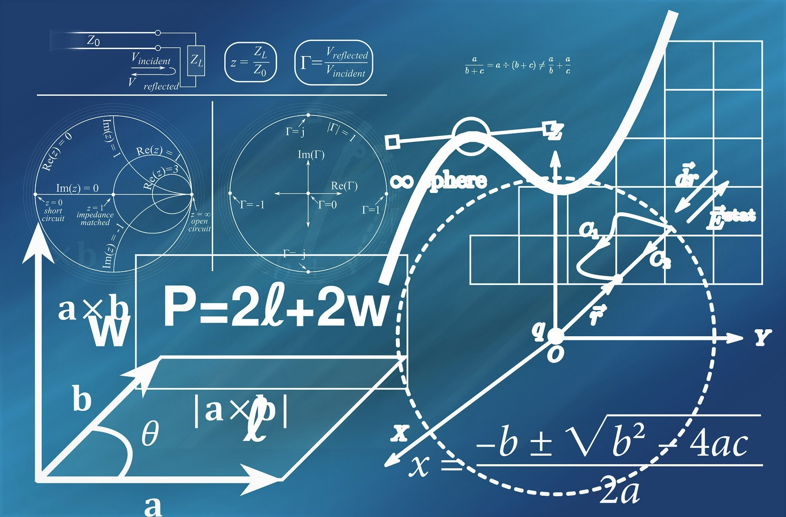

<!--
author:   3M+L

email:    your@mail.org

version:  0.0.1

language: en

narrator: US English Male


translation: Português  translations/Portuguese.md

translation: Deutsch translations/German.md

import: https://raw.githubusercontent.com/liaTemplates/algebrite/master/README.md

import: https://raw.githubusercontent.com/liaTemplates/rextester/master/README.md
-->

# Mathematics and Programming

{{1}}
_Mathematics and Programming work in mostly of cases together. But if you want to be good in both area, then you have to work hard to reach your goals_

{{2}}
````````````````````````````
+----------------------------------+
|Mathematics book cover looks like:|
+----------------------------------+
````````````````````````````

{{3}}
<!-- style="width: 100%" -->

{{4}}
````````````````````````````
+----------------------------+
|Programming code looks like:|
+----------------------------+
````````````````````````````
{{5}}
<!-- style="width: 100%" -->

{{6}}
_I hope it's going to be really fun to learn programming and understand why all machines are result of programming and mathematics._
 @author

##Basic Concepts

First things we have to know is what **Mathematics** and **Programming** are.

> **Mathematics** is the abstract science of number, quantity, and space, either as abstract concepts ( pure mathematics ), or as applied to other disciplines such as physics and engineering ( applied mathematics ).
>
> **Computer programming** is the process of _designing_ and _building_ an executable computer program to accomplish a specific computing result. _Programming_ involves tasks such as: analysis, generating algorithms, profiling algorithms' accuracy and resource consumption, and the implementation of algorithms in a chosen programming language (commonly referred to as coding).

Let say you have some tasks of mathematics like multiplication of two decimal numbers and you have 3 seconds to solve it. I bet if the numbers looks like 3.987656 and 71.456237, 3 seconds would not be enough for you or many other peoples to multiplicate it. For it you will need a calculator to be faster and calculator is result of programming.

Let us look a simple program written in C here:

```c        Math.c
#include <stdio.h>

void main()
{
  printf("Welcome to the real world!\n");
  double number1 = 3.98, number2 = 71.45, result;
  result = number1*number2;
  printf("\nBelow is an example of multiplication of two numbers:");
  printf("\n%lf x %lf = %lf \n",number1,number2,result);
}
```
@Rextester.C_vc

As I said above that the program has been written in C, **C** is Programming Language, that means, Computer do not speak the same language as we do, but they have there own languages.
> There are a lot of **Programming Languages** in the IT World, some of them are: **C, C++, C#, Pascal, Java, Python, etc**.
>
>Here we will see some examples in C and C#, maybe other languages too if there is enough time to do it.

## Programs

Here we will start writing some simple programs and test them in Markdown and so we can exercise our contents understanding/perception and try to do it in other platforms. :-) :-D ;-)

**C#**


```csharp       MiniCalculator.cs
using System;
using System.Collections;
using System.Collections.Generic;
using System.Linq;
namespace Rextester
{
  public class Program
  {
    public static void Main(string[] args)
    {
      var calc = new Calculator();
      calc.number1 = 9D;
      calc.number2 = 4D;
      calc.Add();
      calc.Subt();
      calc.Mult();
      calc.Div();
      calc.Sqrt();
      calc.Pow();
    }
  }
  public class Calculator
  {
    public double number1;
    public double number2;
    public Calculator()
    {

    }
    public Calculator(double number1, double number2)
    :this()
    {
      this.number1 = number1;
      this.number2 = number2;
    }
    public void Add()
    {
      Console.WriteLine("{0} + {1} = {2}",number1,number2,number1+number2);
    }
    public void Subt()
    {
      Console.WriteLine("{0} - {1} = {2}",number1,number2,number1-number2);
    }
    public void Mult()
    {
      Console.WriteLine("{0} x {1} = {2}",number1,number2,number1*number2);
    }
    public void Div()
    {
      Console.WriteLine("{0} / {1} = {2}",number1,number2,number1/number2);
    }
    public void Sqrt()
    {
      Console.WriteLine("Sqrt({0}) = {1}",number1,Math.Sqrt(number1));
    }
    public void Pow()
    {
      Console.WriteLine("{0}^{1} = {2}",number1, number2,Math.Pow(number1,number2));
    }
  }
}

```
@Rextester.eval(@CSharp)

As we know or should know, the letters of alphabet has numeric value in the ASCII-Table and that we will show it in a simple _C_ program below.

**C**

```c        Character.c
#include <stdio.h>
#include <stdlib.h>
#include <string.h>
#include <time.h>
void endJoke();
int main(void)
{
  printf("Welcome to my Program!\n");
  char a = 'a',m = 'M',c='c',h='h',e='e',l='l' ;
  printf("\nValue of %c is %d",m,m);
  printf("\nValue of %c is %d",a,a);
  printf("\nValue of %c is %d",c,c);
  printf("\nValue of %c is %d",h,h);
  printf("\nValue of %c is %d",e,e);
  printf("\nValue of %c is %d",l,l);

  char name[] = "Machel"; int i =0,j=0,k=0, sum=0;
  for(i=0;i<strlen(name);i++)
  {
    sum += name[i];
  }
  printf("\nSum of letters of %s is %i",name,sum);
  for(i=0;i<strlen(name);i++)
  {
    printf("\n%c",name[i]);
  }
  printf("\n");
  printf("Here is the table of 1x1:\n");
  printf("\n");
  for(j=1;j<=10;j++)
  {
    for(k=1;k<=10;k++)
    {
      printf("%4i",j*k);
    }
    printf("\n");
  }
  printf("\n");
  endJoke();
  return 0;
}
void endJoke()
{
  printf("Hello there, are you enjoying the programming?\n I find it really funny, when I understand a little bit what I am programming");
}

```
@Rextester.C_clang

We can also find random numbers using **C** swap numbers as shown below.

```c      Random.c
#include <stdio.h>
#include <stdlib.h>
#include <string.h>
#include <time.h>

void swap(int* x, int* y)
{
  int temp = * x;
  * x = * y;
  * y = temp;
}
int main(void)
{
  int number, x=2, y= 3;
  srand(time(NULL));
  number = rand()%100+1;
  printf("The random number is %d\n",number);
  printf(" x = %i and y = %i\n",x,y);
  swap(&x,&y);
  printf(" x = %i and y = %i",x,y);
}
```
@Rextester.C_vc

**Swift**

Here is a simple example of swift programming.

```swift
//swift 3.0.2
let number = 07;
print("Hello, I'm Swift, a programming language! \n I really enjoyed it.")
print("The number above is \(number)")
```
@Rextester.eval(@Swift)

_I think now we have basic idea about computer programming together with mathematics._

## My Goals

***My next goals are:***

1. programming in C#
2. Latex tools
3. Learn English language

## Others

```````````````````
+-----------------+
|Wekwedu mwana uyu|
+-----------------+
```````````````````
